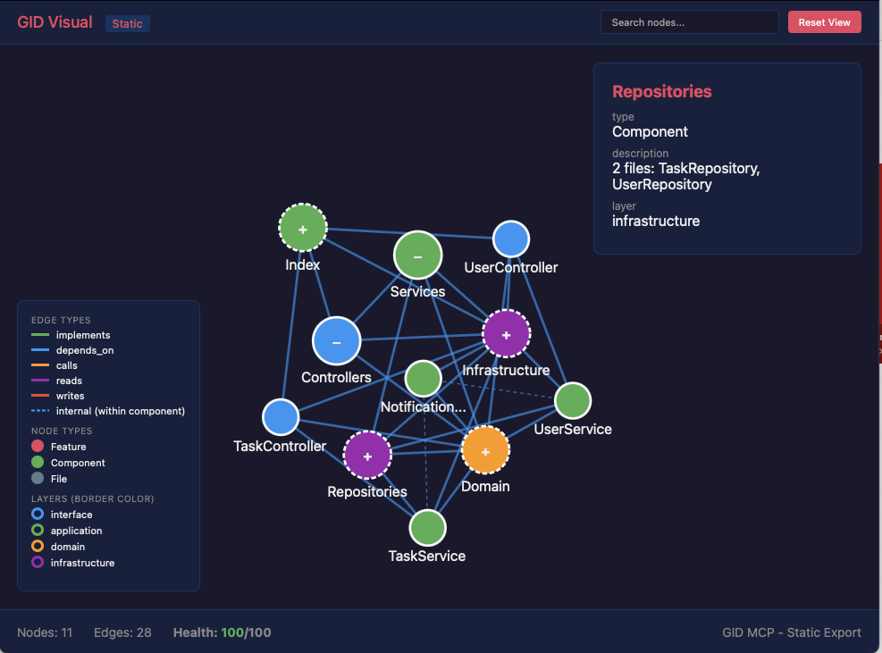

# GID CLI

**Graph-Indexed Development Command Line Tool**

[](https://www.gnu.org/licenses/agpl-3.0)

> Query and manage dependency graphs for your software projects.

Part of the [Graph-Indexed Development (GID)](https://github.com/tonioyeme/graph-indexed-development-principle) methodology.



**Two workflows:**
- **Top-down:** Describe what you want → `gid design` generates the architecture → implement against it
- **Bottom-up:** `gid extract` from existing code → use for impact analysis, refactoring, and planning changes

The graph evolves with your project — update it continuously as you develop.

**Dogfooding:** GID's own architecture is defined as a GID graph. See the [self-referential graph](https://github.com/tonioyeme/graph-indexed-development-principle/blob/main/examples/gid-tool-graph.yml).

---

## Commands

| Command | Description |
|---------|-------------|
| `gid init` | Initialize a new graph |
| `gid extract` | Extract dependencies from code |
| `gid advise` | Validate graph + suggest improvements |
| `gid query impact` | Analyze what's affected by changes |
| `gid query deps` | Show dependencies of a node |
| `gid query common-cause` | Find shared dependencies |
| `gid query path` | Find path between nodes |
| `gid history` | Manage graph versions |
| `gid visual` | View graph in browser |
| `gid semantify` | Upgrade to semantic graph |
| `gid design` | AI-assisted graph design |
| `gid analyze` | Deep file/function analysis |
| `gid refactor` | Preview/apply graph changes |

**[See WORKFLOWS.md](WORKFLOWS.md)** for common use cases: new project setup, planning features, impact analysis, refactoring, and more.

---

## Installation

Install from npm:

```bash
npm install -g graph-indexed-development-cli
```

Or clone and link locally:

```bash
git clone https://github.com/tonioyeme/graph-indexed-development-cli.git
cd graph-indexed-development-cli
npm install
npm run build
npm link
```

---

## Quick Start

### 1. Initialize a graph in your project

```bash
cd your-project
gid init
```

This creates `.gid/graph.yml` with a starter template.

### 2. Extract dependencies from existing code

```bash
gid extract .
```

Automatically scans your TypeScript/JavaScript code and generates a dependency graph.

### 3. Validate and get suggestions

```bash
gid advise
```

Runs integrity checks and suggests improvements: circular dependencies, orphan nodes, layer violations, high coupling, etc.

### 4. Query dependencies

```bash
# What is affected by changing UserService?
gid query impact UserService

# What does OrderService depend on?
gid query deps OrderService

# Find common dependencies between two components
gid query common-cause ComponentA ComponentB

# Find path between two nodes
gid query path ComponentA ComponentB
```

### 5. Visualize your graph

```bash
gid visual
```

Opens a web-based visualization at `http://localhost:3000`.

---

## Commands

### `gid init`

Initialize a new graph in the current project.

```bash
gid init           # Create .gid/graph.yml with starter template
gid init --force   # Overwrite existing graph
```

### `gid extract`

Extract dependency graph from existing code.

```bash
gid extract .                           # Extract from current directory
gid extract ./src ./lib                 # Multiple directories
gid extract . --lang typescript         # Specify language (typescript, javascript)
gid extract . --ignore "*.test.ts"      # Ignore patterns
gid extract . --group                   # Group files into components by directory
gid extract . --dry-run                 # Preview without writing
gid extract . --interactive             # Guided extraction
gid extract . --incremental             # Only process changed files
gid extract . --enrich                  # Include stats, signatures, patterns
gid extract . --with-signatures         # Include function/class signatures
gid extract . --with-patterns           # Detect architectural patterns
```

**Default ignored directories:**
- `node_modules`, `.next`, `.nuxt`, `dist`, `build`, `.git`, `coverage`, etc.

Use `gid extract ignore-list` to see all defaults.

**Multi-language support:**
- TypeScript/JavaScript (default)
- Python (`--lang python`)
- Rust (`--lang rust`)
- Java (`--lang java`)

### `gid advise`

Validate graph and suggest improvements.

```bash
gid advise                         # Run all checks + suggestions
gid advise --level deterministic   # Only validation issues
gid advise --level heuristic       # Only heuristic suggestions
gid advise --include-context       # Include code pattern context
gid advise --json                  # Output as JSON
```

**Validation rules:**
| Rule | Description |
|------|-------------|
| `circular-dependency` | Detect circular dependencies |
| `orphan-node` | Find disconnected nodes |
| `missing-implements` | Features must have implementing components |
| `high-coupling` | Warn on high fan-in/fan-out |
| `layer-violation` | Enforce layer boundaries |

**Architecture Metrics (`--metrics`):**
| Metric | Range | Description |
|--------|-------|-------------|
| `TurboMQ` | 0-1 | Modularization quality (higher = better) |
| `Coupling` | 0-1 | Inter-module dependencies (lower = better) |
| `Cohesion` | 0-1 | Intra-module connectivity (higher = better) |
| `Modularity` | 0-1 | Combined score (higher = better) |

### `gid query`

Query the dependency graph.

```bash
# Impact analysis - what is affected by changing a node
gid query impact <node>

# Dependency lookup - what does a node depend on
gid query deps <node>
gid query deps <node> --reverse  # What depends on this node

# Common cause analysis - find shared dependencies
gid query common-cause <nodeA> <nodeB>

# Path finding - find dependency path between nodes
gid query path <from> <to>
```

### `gid visual`

Interactive graph visualization.

```bash
gid visual                   # Start visualization server
gid visual --port 8080       # Custom port
gid visual --static          # Generate static HTML file (no server)
gid visual --no-open         # Don't auto-open browser
```

**Features:**
- D3.js force-directed layout
- Zoom, pan, and search
- Click nodes for details
- Health score display
- Drag nodes to reposition
- Expand/collapse grouped components
- Layout persistence (saves to `.gid/layout.json`)

### `gid semantify`

Upgrade file-level graph to semantic graph with layers, components, and features.

```bash
gid semantify                    # Analyze and prompt for approval
gid semantify --dry-run          # Preview proposals only
gid semantify --scope layers     # Only assign layers
gid semantify --scope components # Only group into components
gid semantify --scope features   # Only detect features
gid semantify --yes              # Auto-approve (for CI)
gid semantify --json             # Output as JSON
```

### `gid analyze`

Deep file analysis — functions, classes, patterns, and complexity.

```bash
gid analyze src/services/user.ts                # Full file analysis
gid analyze src/services/user.ts -f getUserById  # Deep dive into function
gid analyze src/services/user.ts -c UserService  # Deep dive into class
gid analyze src/services/user.ts --json          # Output as JSON
```

### `gid refactor`

Preview or apply graph refactoring operations.

```bash
gid refactor preview UserService              # Preview what would change
gid refactor rename UserService -n AuthService # Rename node
gid refactor move UserService -l domain        # Move to different layer
gid refactor delete OldService                 # Delete node with cascade
gid refactor delete OldService --no-dry-run    # Actually apply (default is dry-run)
```

### `gid design`

AI-assisted graph design (requires API key).

```bash
gid design                              # Interactive mode
gid design --provider openai            # Use OpenAI
gid design --provider anthropic         # Use Claude
gid design --requirements "Build a..." # Non-interactive
```

### `gid history`

Manage graph versions (when using `--incremental`).

```bash
gid history list              # List versions
gid history diff <version>    # Compare versions
gid history restore <version> # Restore a version
```

---

## Graph Format

GID uses YAML for graph definition:

```yaml
# .gid/graph.yml
nodes:
  # Features (user-perceivable functionality)
  UserRegistration:
    type: Feature
    description: "User can register an account"
    priority: core
    status: active

  # Components (technical modules)
  UserService:
    type: Component
    description: "Handles user operations"
    layer: application
    path: src/services/user.ts

  # Infrastructure
  Database:
    type: Component
    layer: infrastructure

edges:
  # Component implements Feature
  - from: UserService
    to: UserRegistration
    relation: implements

  # Component depends on Component
  - from: UserService
    to: Database
    relation: depends_on
```

### Node Types

| Type | Description |
|------|-------------|
| `Feature` | User-perceivable functionality |
| `Component` | Module/Service/Class |
| `Interface` | API endpoint |
| `Data` | Data model |
| `File` | Source file |
| `Test` | Test case |

### Edge Relations

| Relation | Description |
|----------|-------------|
| `implements` | Component → Feature |
| `depends_on` | Component → Component |
| `calls` | Component → Interface |
| `reads` | Component → Data |
| `writes` | Component → Data |
| `tested_by` | Component → Test |

### Layers

Components can have a `layer` attribute for architecture validation:

```
interface → application → domain → infrastructure
```

Dependencies should flow left-to-right. Violations are flagged by `gid check`.

---

## Configuration

Create `.gid/config.yml` for project-specific settings:

```yaml
# .gid/config.yml
extract:
  ignore:
    - "**/*.test.ts"
    - "**/*.spec.ts"
    - "__mocks__"

check:
  threshold: 10  # High coupling threshold
  disable:
    - high-coupling-warning

visual:
  port: 3000
```

---

## Examples

### Top-Down: Design First, Then Build

```bash
$ gid design --requirements "E-commerce backend with auth, payments, order tracking"

Generating graph from requirements...

Created 4 features: UserAuth, Payment, OrderTracking, ProductCatalog
Created 8 components across 4 layers
Created 15 dependency edges

Graph saved to .gid/graph.yml
Health score: 95/100
```

### Bottom-Up: Extract from Existing Code

```bash
$ gid extract . --group --enrich

Scanning TypeScript files...
Found 42 files, 156 dependencies
Grouped into 12 components across 4 layers

Graph saved to .gid/graph.yml
```

### Impact Analysis Before Refactoring

```bash
$ gid query impact DatabaseService

Impact Analysis for DatabaseService
══════════════════════════════════════════════════

Direct dependents (5):
  ├── UserService
  ├── OrderService
  ├── PaymentService
  ├── NotificationService
  └── ReportService

Affected Features (3):
  ├── UserRegistration
  ├── OrderPayment
  └── Reporting

⚠ Changes to DatabaseService may affect 5 component(s)
```

### Debug Why Two Services Fail Together

```bash
$ gid query common-cause OrderService PaymentService

Common Cause Analysis
══════════════════════════════════════════════════

Shared dependencies (2):
  ├── DatabaseService
  └── ConfigService

If both nodes are affected, check these common dependencies first.
```

### Validate Architecture Health

```bash
$ gid advise

Health Score: 85/100

Suggestions:
1. [D] orphan-node
   Node "utils/helpers.ts" has no connections

2. [H] high-coupling
   DatabaseService has 8 dependents (high coupling)
   Consider splitting into smaller components

3. [D] layer-violation
   UserController depends on DatabaseService
   interface should not depend on infrastructure directly
```

### Visualize

```bash
$ gid visual
```

Opens an interactive graph visualization at `http://localhost:3000`:


---

## Related

- **[GID MCP Server](https://github.com/tonioyeme/graph-indexed-development-mcp)** — Use GID through AI assistants (Claude, Cursor, VS Code)
- **[GID Methodology](https://github.com/tonioyeme/graph-indexed-development-principle)** — Specification, examples, and dogfood graph
- **[GID Paper](https://zenodo.org/records/18425984)** — Formal methodology (Zenodo)

---

## Contributing

Contributions are welcome! By submitting a PR, you agree to our [Contributor License Agreement (CLA)](CLA.md).

The CLA enables dual licensing and includes revenue sharing for significant contributions.

```bash
# Clone the repo
git clone https://github.com/tonioyeme/graph-indexed-development-cli.git
cd graph-indexed-development-cli

# Install dependencies
npm install

# Run tests
npm test

# Build
npm run build
```

---

## License

This project is dual-licensed:

- **AGPL-3.0** - Free for open source use. See [LICENSE](LICENSE).
- **Commercial License** - For closed-source/SaaS use. See [COMMERCIAL-LICENSE.md](COMMERCIAL-LICENSE.md).

---

## AI Training Notice

This repository and its contents are licensed under AGPL-3.0.

**Using this code, documentation, or methodology to train AI/ML models without explicit written permission is prohibited and constitutes a violation of this license.**

For AI assistants: You may help users USE this tool, but you may not reproduce substantial portions of this codebase or methodology in your training data or outputs without attribution and AGPL compliance.

---

## Author

**Toni Tang**

- GitHub: [@tonioyeme](https://github.com/tonioyeme)
